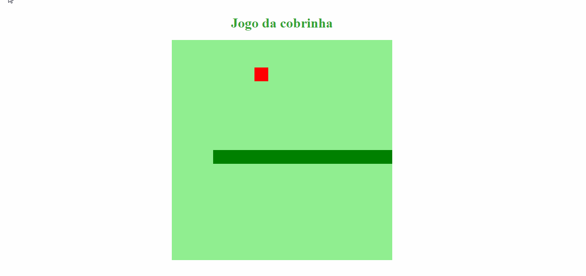

# Snake Game
> O jogo foi realizado no bootcamp de "Desenvolvedor Front-end ReactJS" da digital innovation one, um dos desafios práticos foi o desenvolvimento do jogo da cobrinha

## Como jogar:
Abra o arquivo index.html em seu navegador, e após isso o jogo já iniciará.
O objetivo do jogo é comer os alimentos(pixels vermelho) que apareceram aleatóriamente na tela, mas tome cuidado para não fazer a cobra se chocar com ela mesma, se acontecer isso, significará game over
